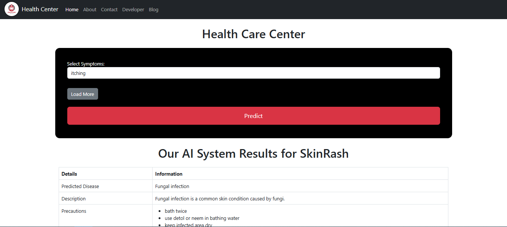
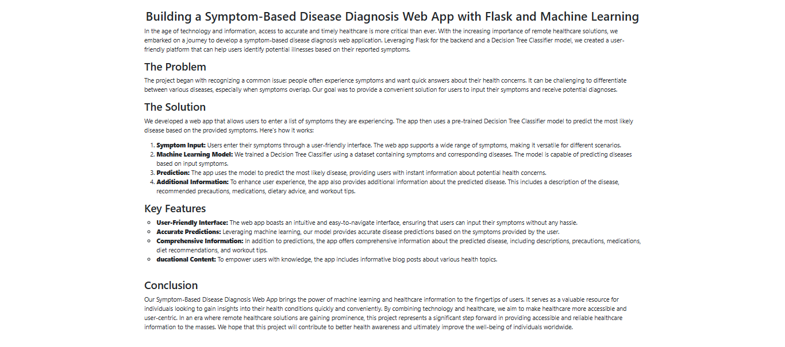
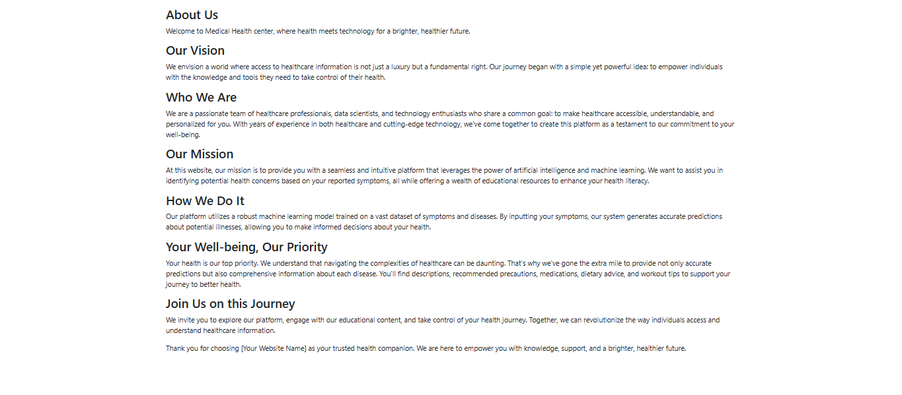

# Personalized-Medicine-Recommending-System
Personalized Medicine Recommending System 

A Personalized Medicine Recommendation System in machine learning (ML) is a software application designed to assist healthcare professionals and patients in selecting the most appropriate medication based on various factors such as medical history, symptoms, demographics, and drug interactions. Here's a breakdown of its components and functionality:

Data Collection and Preprocessing: The system collects and preprocesses vast amounts of medical data, including patient records, electronic health records (EHRs), clinical trials data, drug information, and research articles. This data is cleaned, standardized, and structured for analysis.

Feature Selection: Relevant features are extracted from the collected data, such as patient demographics, medical history, laboratory test results, symptoms, diagnoses, and drug characteristics. Feature selection techniques help identify the most informative variables for predicting medication recommendations.

Machine Learning Models: Various machine learning algorithms are employed to develop predictive models based on the selected features. Common ML techniques include decision trees, random forests, support vector machines (SVM), logistic regression, and neural networks. These models learn patterns from historical data to make predictions about suitable medications for new patients.

Model Training and Evaluation: The ML models are trained on labeled datasets, where each instance includes patient attributes and the corresponding prescribed medication. The training process involves optimizing model parameters to minimize prediction errors. The performance of the trained models is evaluated using metrics such as accuracy, precision, recall, and F1-score through techniques like cross-validation.

Recommendation Generation: Once the models are trained and validated, the system can generate medication recommendations for new patients. When a user inputs relevant information about a patient (e.g., age, gender, medical history, symptoms), the system applies the trained models to predict the most suitable medications for that individual.

Personalization and Adaptation: The system may incorporate personalized medicine approaches by considering individual patient characteristics and preferences. It can also adapt over time as new data becomes available, continuously improving its recommendations through techniques like online learning.

User Interface: The system provides a user-friendly interface for healthcare professionals, pharmacists, or patients to interact with. This interface allows users to input patient information, view recommended medications, explore explanations for recommendations, and adjust parameters if necessary.

Integration with Healthcare Systems: The recommendation system can be integrated with existing healthcare information systems, such as electronic medical records (EMRs) or pharmacy management systems, to streamline the medication selection process and ensure seamless adoption by healthcare providers.
